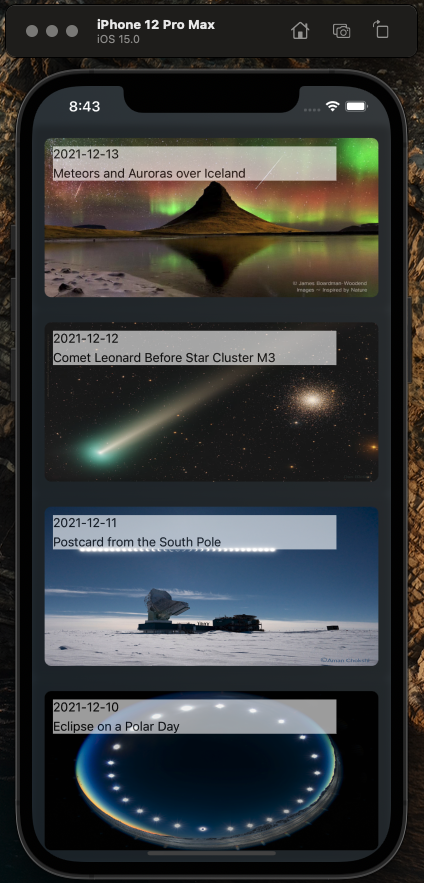

[![Contributors][contributors-shield]][contributors-url]
[![Stargazers][stars-shield]][stars-url]

# AstroLens

The most beautiful space - rocket - astronomy - guardians of the galaxy wanna be Star-Lord type of iOS mobile application found in the galaxy.
# It's THAT good

<br />
<p align="center">
  
</p>

## Table of Contents
* [Getting Started](#getting-started)
  * [Prerequisites](#prerequisites)
  * [Installation](#installation)
astr
See NASA's API's here -> https://api.nasa.gov/

## Getting Started

To get a local copy up and running follow these simple example steps.

### Prerequisites

* XCode 13 and a NASA API key (optional). To generate an API key from NASA visit -> https://api.nasa.gov/ 
* It takes only a minute to create your own API key but the project uses a demo one also on startup, although the demo key allows limited requests -> api_key=DEMO_KEY 
* Once you create your own key just replace DEMO_KEY inside the NASAApi framework
* E.g. search 'api_key=DEMO_KEY' in the project and change it as follows 'api_key=gghhshjsndnsnk23443223432'

### Installation

1. Clone the repo
```sh
git clone https://github.com/sean-luis/astro-lens-ios.git
```
2. Open in XCode

3. Replace DEMO_KEY with your generated API key (optional)
